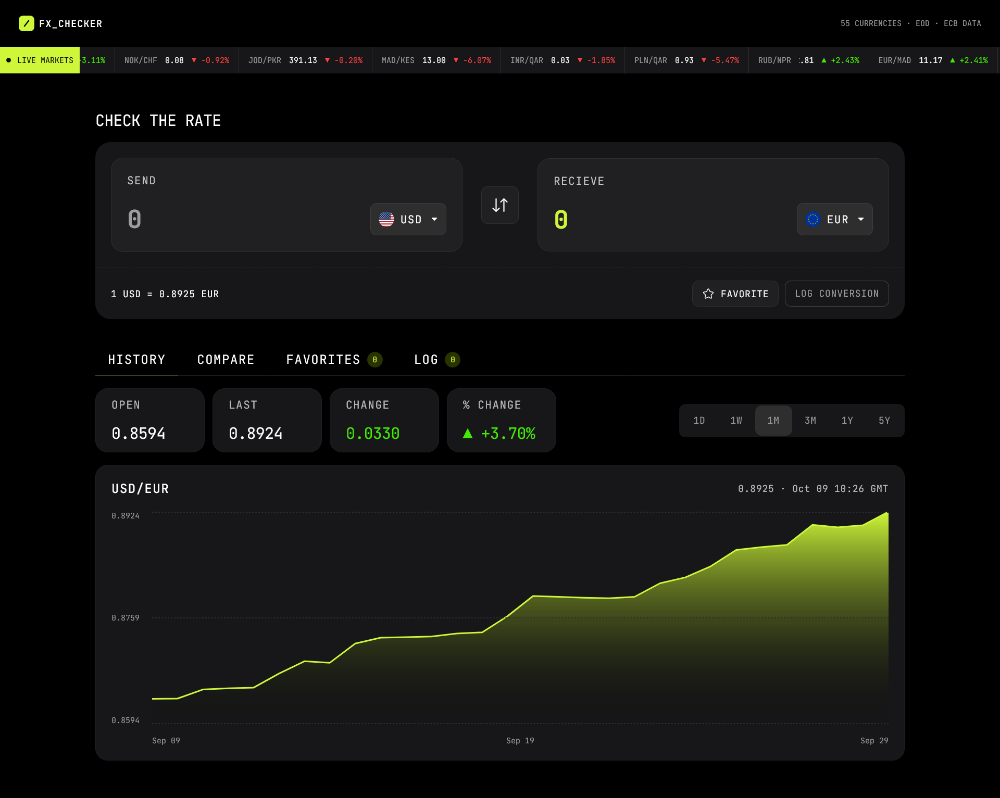

# Foreign Exchange Converter

This is a site powered by the Frankfurter currency exchange API used to convert from one currency to another and also compare a currency with other currencies. It is bui;t mainly with React and Typescript.

## Technologies

`React`
`Typescript`
`Vite`
`Tailwind`

## Features

  - Convert a certain amount from one currency to another with live rates in real-time
  - View a line and area chart of the active pair's rate over a time range of 1 day, 1 week, 1 month, 3 months, 1 year and 5 years
  - Compare the rate of a currency with a range of other currencies at once.
  - Pin and unpin a currency pair to favorites with it's live rate and 24 hr change.
  - Log conversions to the Conversion Log

## The Process

This site was built with React and Typescript.  The first thing I did was to create the necessary utilities and define variables for the colors used in the site. I also used CSS's font-face at-rule to define and import the fonts.
I utilized React Context to group related data 
together and avoid prop drilling. The chart in the History Tab was made with the Chartjs package and most network requests were done with React's use hook.
This enables loading with Suspense and I then used React's Error Boundary component to handle errors caused by failed network requests. The Frankfurter currency exchange API was used to get the current rates for a certain currency pair as well as the rate at a specific period.
The localStorage API was used to persist favorited currency pairs and also logged conversions. I finally added the ability to specify the base and the quote in the URL.

### What I Learned

From building this site, I used React's `Context` and the `useContext` hook for the first time. I also utilized the `use` hook to handle fetch requests and when paired with the `Suspense` component, create loading states. So just from this site, I learned and used:
- React's use hook
- React's Suspense component
- React's Error Boundary
- Chartjs - for creating charts and graphs

### Useful Resources

[Tailwind Docs](https://tailwindcss.com) - For quickly looking up tailwind utilities

### AI Collaboration

No AI was used in this project as I am still learning and wanted to code everything myself. In later projects, I might utilize AI.

## Screenshot

## Video

## Links
- Solution URL - [https://github.com/zardalt/foreign_exchange_checker](https://github.com/zardalt/foreign_exchange_checker)
- Live Site URL - [https://zardalt.github.io/foreign_exchange_checker](https://zardalt.github.io/foreign_exchange_checker)

## Author
- Frontend Mentor - [@zardalt](https://www.frontendmentor.io/profile/zardalt)
- Twitter - [zardalt_](https://x.com/zardalt_)
- Linkedin - [akanimo-udoh](https://www.linkedin.com/in/akanimo-udoh-348942437/)
